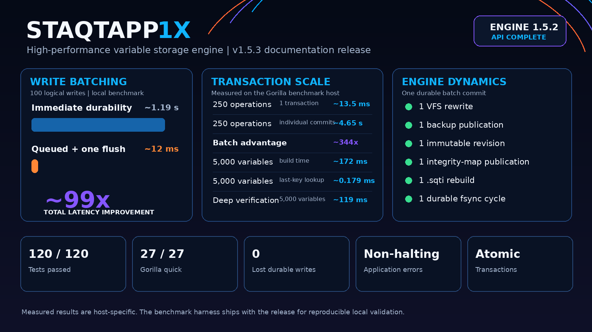

# Staqtapp 1X

[](docs/GORILLA_BENCHMARK_REPORT_1_4_9.md)

**[Core API Quick Reference (PDF)](docs/Staqtapp_1X_1.5.3_Core_API_Quick_Reference.pdf)**

Staqtapp 1X is a high-performance Python storage engine for integrating multiple independent variable-storage files. It combines mapped reads, atomic streamed writes, explicit typed values, transactions, immutable revisions, integrity maps, surgical recovery, optional write batching, and a broad operational API without forcing application-level errors to halt the controller.

## Install

```bash
python -m pip install .
```

Optional accelerated typed JSON:

```bash
python -m pip install "staqtapp[fastjson]"
```

## Quick start

```python
import staqtapp

staqtapp.configure(storage_dir="./data")
staqtapp.makevfs("accounts", "Production", "Primary")

staqtapp.set_value("user:1001", {
    "name": "Rob",
    "active": True,
    "balance": 500,
})

user = staqtapp.get_value("user:1001")
```

## Atomic multi-operation updates

`run_transaction()` is single-VFS, mutation-only, read-your-own-writes, and all-or-nothing. It is the preferred path when related changes must commit together or when many writes target the same VFS.

```python
result = staqtapp.run_transaction([
    ("set_value", ("balance", 400)),
    ("set_value", ("status", "paid")),
    ("removevar", ("temporary",)),
])

if not result:
    print(result.failure.error_type, result.failure.message)
```

## Optional adaptive write batching

Immediate durability is the default. Enable process-local batching when reduced write latency is worth an explicit queued-versus-durable boundary.

```python
staqtapp.configure(
    write_batching=True,
    batch_max_operations=100,
    batch_max_wait_ms=5,
)

receipt = staqtapp.set_value("event:1", {"type": "login"})
result = staqtapp.flush_writes()  # durability barrier
```

## Direct operational examples

```python
staqtapp.rebuild_read_index()
chunk = staqtapp.read_payload_range("blob", start=4096, length=1024)

report = staqtapp.verify_integrity(deep=True)
revisions = staqtapp.list_revisions(limit=10)

staqtapp.optimize_vfs()
staqtapp.compact_vfs(keep_revisions=32)
```

## Non-halting result model

Ordinary public API failures return a false-valued result rather than escaping as application exceptions.

```python
result = staqtapp.get_value("missing")
if not result:
    print(result.error_type)

# Execution continues.
staqtapp.set_value("next", "operation")
```

## Documentation

- [Core API Quick Reference](docs/Staqtapp_1X_1.5.3_Core_API_Quick_Reference.pdf)
- [Write batching](docs/WRITE_BATCHING_1_5.md)
- [Maintenance guide](docs/MAINTENANCE_GUIDE_1_5.md)
- [Recovery guide](docs/RECOVERY_GUIDE.md)
- [Security model](docs/SECURITY_MODEL.md)
- [Gorilla benchmark report](docs/GORILLA_BENCHMARK_REPORT_1_4_9.md)

## Release note

Version 1.5.3 is documentation-only. The engine behavior and operational API are unchanged from 1.5.2.
